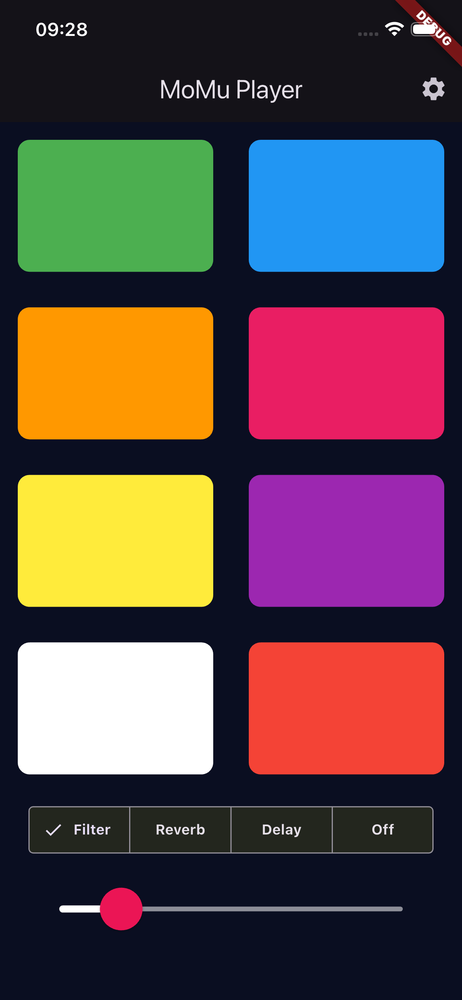

# MoMu Player

MoMu (More Music) Play is an open source Music Player written in Dart / Flutter. 
MoMu is meant to make music players accessible to anyone and to play more music. It is currently in development status. 

# Actual Screen

 
# What the MoMu Player does.

The MoMu-Player is designed to be simple and easy to use. It can play one octave of predefined sounds (Wurli, Xylophone, Piano as of now). It can mix Reverb, Echo and Filter into the those sounds so you can create your own sounds. It is made for Kids or People who wants to create music but are not good with Keyboards. 

# What is used in my project.

The Project is written in Flutter so it can be deployed on any platform (mobile, web, desktop, and embedded devices). It uses the Flutter framework because of the easyiness to build user interfaces and it uses the SoLoud Audio Engine to play audio.
- https://flutter.dev/

The underlying audioengine is called SoLoud and offers a lot of features. SoLoud is an easy to use, free, portable c/c++ audio engine for games and was written by Jari Komppa.
- https://solhsa.com/soloud/index.html
- https://solhsa.com/

It is embedded in my project with the flutter_soloud package which was written by Marco Bavagnoli and that package allows me to use SoLoud in my Flutter app. The flutter_soloud package than allows me to implement Soundseffects like Filters, Reverb, Echo and more. In a later version I want to implement more Effects, perhaps the Musicplayer and the Midi-Solution. 
At this stage a Filter, Reverb and an Delayeffect is already implemented. 
- https://pub.dev/packages/flutter_soloud
- https://marcobavagnoli.com/

As I am a beginner in flutter programming so I got a lot of help from Claude (Anthropic Claude 3.5 Sonnet) last year who lives in my VS Code Extension called Continue Dev since than.
- https://www.continue.dev/
- https://www.anthropic.com/claude

and I also use Olllama for all the local LLM models like qwen3-coder30b (recommended) and devstral which helps my nowadays because Claude got so expensive.
- https://ollama.com/
- https://ollama.com/library/qwen2.5-coder/tags (chat, edit / 14b because I have an MacMini M4 with 24 GByte Ram)
- https://ollama.com/library/qwen3-coder (only for architect tasks)

I use qwen2.5-coder:1.5b for autocompletion
- https://ollama.com/library/qwen2.5-coder

and the Voyage Rerank2 as Reranker Modelle for my Rerank tasks.
- https://www.voyageai.com/

This project was deeply inspired by the amazing work of Dr. Angela Yu and her Flutter Programming Course. I really really hope she will update her Course really soon! It is didactly the best course I attended!
- https://appbrewery.com/

Please write me an Email if you have any questions or suggestions or want to work with me on this project with me. 
Happy Coding
Karim  

